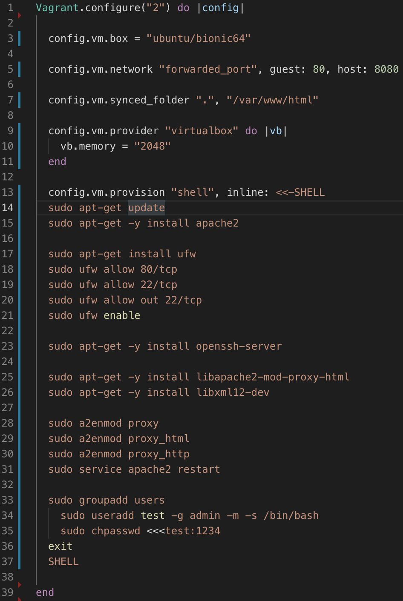

# Technische Berufsschule Zürich Modul 300 Leitsungsbeurteilung 2

1. Persönlicher Wissensstand
   1. Linux
   2. Virtualisierung
   3. Vagrant
   4. Git
2. Docker VM vorbereitung Installation mit Vagrant
   1. Vorbereitungen Docker Install
   2. Vorbereitungen Docker Compose Install
   3. Vagrant Box Release
3. Sicherheitsmassnahmen
     1. Massnahme 1
     2. Massnahme 2
     3. Massnahme 3
4. Tests
    1. Testfall 1
    2. Testfall 2
5. Vergleich Vorwissen und Wissenszuwachs
   1. Vorwissen
   2. Wissenszuwachs
6.  Reflexion

# Persönlicher Wissensstand
Persönlicher Wissenstand zu LB2

## Linux
Als Linux oder GNU/Linux (siehe GNU/Linux-Namensstreit) bezeichnet man in der Regel freie, unixähnliche Mehrbenutzer-Betriebssysteme, die auf dem Linux-Kernel und wesentlich auf GNU-Software basieren. Die weite, auch kommerzielle Verbreitung wurde ab 1992 durch die Lizenzierung des Linux-Kernels unter der freien Lizenz GPL ermöglicht.

## Virtualisierung
Virtualisierung bezeichnet in der Informatik die Nachbildung eines Hard- oder Software-Objekts durch ein ähnliches Objekt vom selben Typ mit Hilfe eines Abstraktions-Layers. Dadurch lassen sich virtuelle (d. h. nicht-physische) Geräte oder Dienste wie emulierte Hardware, Betriebssysteme, Datenspeicher oder Netzwerkressourcen erzeugen. Dies erlaubt es etwa, Computer-Ressourcen (insbesondere im Server-Bereich) transparent zusammenzufassen oder aufzuteilen, oder ein Betriebssystem innerhalb eines anderen auszuführen. 

## Vagrant
Vagrant ist eine Ruby-Anwendung (open-source) zum Erstellen und Verwalten von virtuellen Maschinen (VMs).

Die Ruby-Anwendung dient als Wrapper (engl. Verpackung, Umschlag) zwischen Virtualisierungssoftware wie VirtualBox, VMware und Hyper-V und Software-Konfiguration-Management-Anwendungen bzw. Systemkonfigurationswerkzeugen wie Chef, Saltstack und Puppet.

## Git
Git ist ein verteiltes Versionskontrollsystem zum Nachverfolgen von Änderungen im Quellcode während der Softwareentwicklung. Es ist für die Koordinierung der Arbeit unter Programmierern konzipiert, es kann jedoch verwendet werden, um Änderungen in jedem Dateisatz nachzuverfolgen. Zu den Zielen gehören Geschwindigkeit, Datenintegrität und Unterstützung für verteilte, nicht lineare Workflows.

-------------------

<tab>    | <tab>
--------------------|--------------------------------------------------------------------------------------------------------------------------------------------------------------------
**Befehle**   | Verwendung
vagrant box add http://10.1.66.11/vagrant/ubuntu/xenial64.box --name ubuntu/xenial64        | #Vagrant-Box
vagrant init ubuntu/xenial64       | #Vagrantfile erzeugen 
cd Pfad/zu/meiner/Vagrant-VM | #Zum Verzeichnis der VM wechseln
vagrant ssh| #SSH-Verbindung zur VM aufbauen
ls -l /bin| #Bin-Verzeichnis anzeigen
df -hdf -h| #Freier Festplattenspeicher
free -m| #Freier Arbeitsspeicher

## Vagrantfile
Das Vagrantfile dient der Konfiguration der VM, bevor man sie das erste Mal aufstartet.

# Docker VM vorbereitung Installation mit Vagrant
## Vagrantfile
Das Vagrantfile dient der Konfiguration der VM, bevor man sie das erste Mal aufstartet.

# Ubuntu Docker Vm
## Vorbereitungen Docker Install
Um Später mit dem eigentlichen Aufsetzen des Containers beginnen zu können müssen wir zwei kleine Vorbereitungen treffen. Als erstes die Docker pakete installieren,

First, in order to ensure the downloads are valid, add the GPG key for the official Docker repository to your system:
`curl -fsSL https://download.docker.com/linux/ubuntu/gpg | sudo apt-key add -`

Add the Docker repository to APT sources:
`sudo add-apt-repository "deb [arch=amd64] https://download.docker.com/linux/ubuntu $(lsb_release -cs) stable"`

Next, update the package database with the Docker packages from the newly added repo:
`sudo apt-get update`

Make sure you are about to install from the Docker repo instead of the default Ubuntu 16.04 repo:
`apt-cache policy docker-ce`

Finally, install Docker:
`sudo apt-get install -y docker-ce`

Docker should now be installed, the daemon started, and the process enabled to start on boot. Check that it's running:
`sudo systemctl status docker`

## Vorbereitungen Docker Compose Install
Curl installieren
`sudo apt-get install curl`

Run this command to download the current stable release of Docker Compose:
`sudo curl -L "https://github.com/docker/compose/releases/download/1.24.0/docker-compose-$(uname -s)-$(uname -m)" -o /usr/local/bin/docker-compose`

Apply executable permissions to the binary:
`sudo chmod +x /usr/local/bin/docker-compose`.

##Making a Box

We're now going to clean up disk space on the VM so when we package it into a new Vagrant box, it's as clean as possible. First, remove APT cache
`sudo apt-get clean`

Then, "zero out" the drive (this is for Ubuntu):
`sudo dd if=/dev/zero of=/EMPTY bs=1M`
`sudo rm -f /EMPTY`

Lastly, let's clear the Bash History and exit the VM:
`cat /dev/null > ~/.bash_history && history -c && exit`

We're now going to repackage the server we just created into a new Vagrant Base Box. It's very easy with Vagrant:
`vagrant package --output mynew.box`

Add the Box into Your Vagrant Install
`vagrant box add mynewbox mynew.box`

## Firewall Regeln

Ich habe mich für folgende Firewall Regeln entschieden. Diese hatten keinen besonderen Grund, einfach, dass ich beim installieren auf keine Probleme stosse.

# Vagrant Box Release

Nachdem alle Services auf dem Server installiert wurden kann man mithilfe des commands `vagrand packet --output <boxname>.box` die im aktuellen Verzeichnis laufende VM packetieren und ein .box File erstellen. 

Anschliessend muss man sich bei https://vagrantcloud.com anmelden und den Button "Create a new Vagrant Box" anwählen. Darin folgt man den einzelnen Schritten. Beim Feld "Provider" wählt man "virtualbox" aus, da alles auf dieser Software aufgesetzt wurde. Anschliessend kann man das eben erstellte .box File hochladen und die Vagrant Box Releasen.

## Sicherheitsmassnahmen
###  Überwachung
Software wie "Rancher" kann genutzt werden im die Container zu überwachen und Meldungen zu erzeugen.

### Sicherheitsaspekte & Sicherheitsmassnahme

#### Massnahme 1: Kernel Exploits
Um Kernel exploits zu verhindern wurden die zugewiesenen System Ressourcen festgelegt.

#### Massnahme 2: Vergiftete Images
Images werden nur von Docker Hub und Dockerverifizierte Sites geladen. Somit ist vereringert das Images Viren und weiteres beinhalten.

#### Massnahme 3: Benachrichtigungen
Mit Überwachungssoftware können überlastungen und anderes unnatürliches verhalten verhindert werden.

## Tests
### Testfall 1
__Titel:__ Start der VM

__Datum:__ 5.5.19

__Beschreibung:__ Die VM wird gestartet.

__Erwartetes Ergebnis:__ Die Erwartung ist, dass die VM gestartet wird.

__Eigenliches Ergebnis:__ Die VM startet.

### Testfall 2
__Titel:__ Die .box kann generiert werden

__Datum:__ 5.5.19

__Beschreibung:__ eine .box datei wird aus der VM gezogen.

__Erwartetes Ergebnis:__ die .box wird generiert und ist brauchbar.

__Eigenliches Ergebnis:__ die .box wird generiert.

# Vergleich Vorwissen und Wissenszuwachs & Reflexion
## Vorwissen
Mein Vorwissen zum Containerisierung war minimal. Aus geschäftsevents kurz angehaucht. Jedoch spielte ich schon längeren damit zuhause mal damit zu spielen.

## Wissenszuwachs
Ich kenne mich praktisch und auch theoretish nun mehr mit Containerisierung aus. mit Vagrant und Packer.

## Reflexion
Ich hatte starke probleme mit der LB2. Probleme mit Git sowie viele hindernisse mit packer führten dazu, dass ich sehr lange nicht voran kam und meinen "interesse" verlor. Einen kompletten neuanfang half da weiter. 

### Reflexion Modul
Ich habe sehr viel im Modul gelernt. Jedoch konnte ich aus persönlichen gründen nicht so viel Effizienz aufwenden um mich ganz mit dem Modul zu beschäftigen. Ich war in den Stunden unproduktiv und kam nicht voran. Vorallem hatte ich grosse Probleme mit Git und dem bereitgestellten netzwerk welche mich negativ beeinflussten.

Ich hätte besseres Leisten können und erwartete auch mehr als ich geleistet habe. Jedoch führte das Modul dazu, dass ich vielleicht auch meine Individuelle praktische arbeit mit containerisierung machen werde.