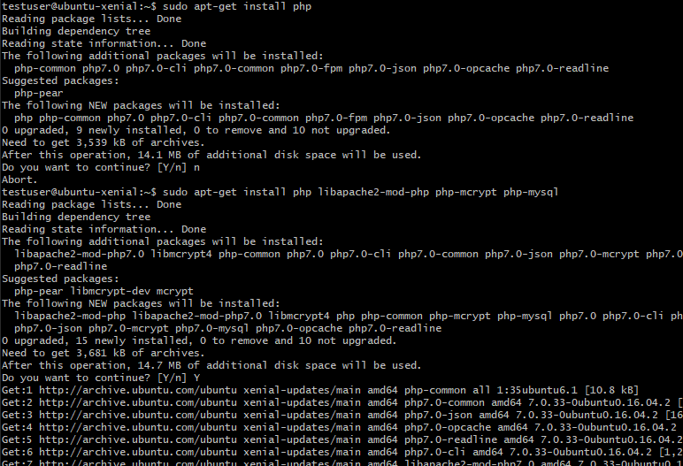
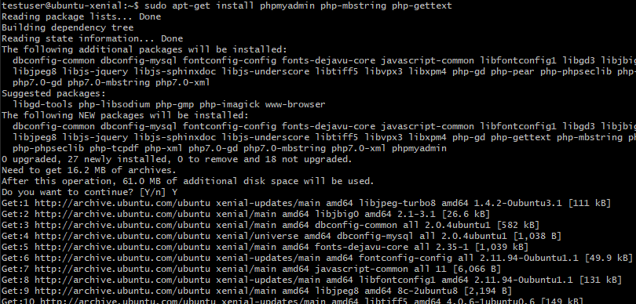
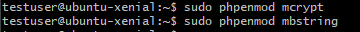

# Technische Berufsschule Zürich Modul 300 Leitsungsbeurteilung 2

1. Persönlicher Wissensstand
   1. Linux
   2. Virtualisierung
   3. Vagrant
   4. Git
2. Docker VM vorbereitung Installation mit Vagrant
   1. Vorbereitungen Docker Install
   2. Vorbereitungen Docker Compose Install
   3. Vagrant Box Release
3. Sicherheitsmassnahmen
     1. Massnahme 1
     2. Massnahme 2
     3. Massnahme 3
4. Tests
    1. Testfall 1
    2. Testfall 2
    3. Testfall 3
5. Vergleich Vorwissen und Wissenszuwachs
   1. Vorwissen
   2. Wissenszuwachs
6.  Reflexion

# Persönlicher Wissensstand
Persönlicher Wissenstand zu LB3

## Linux
Microservices sind ein Weg, Softwaresysteme so zu entwickeln und zu kombinieren, dass sie aus kleinen, unabhängigen Komponenten bestehen, die untereinander über das Netz interagieren. Das steht im Gegensatz zum klassischen, monolithischen Weg der Softwareentwicklung, bei dem es ein einzelnes, grosses Programm gibt.

## Virtualisierung
Entwickler können Software lokal bauen, die woanders genauso laufen wird – sei es ein Rack in der IT-Abteilung, der Laptop eines Anwenders oder ein Cluster in der Cloud.

Administratoren können sich auf die Netzwerke, Ressourcen und die Uptime konzentrieren und müssen weniger Zeit mit dem Konfigurieren von Umgebungen und dem Kampf mit Systemabhängigkeiten verbringen.

## Vagrant
Docker ist ein Programm, das für die Containerisierung genutzt wird. Wenn man das Docker paket herunterlädt bekommt man man einige Features mitinstalliert die man ebenfalls nutzen kann. Docker liefert ein ganzes Set an neuen Kommandos die man sowohl auf der Kommandozeile als auch in Skripts und im Dockerfile nutzen kann. Es hat sehr viele Ähnlichkeiten zu Vagrant. Der grosse unterschied ist nur, dass Vagrant zur Virtualisierung genutzt wird.

## Git
Docker ist ein Programm, das für die Containerisierung genutzt wird. Wenn man das Docker paket herunterlädt bekommt man man einige Features mitinstalliert die man ebenfalls nutzen kann. Docker liefert ein ganzes Set an neuen Kommandos die man sowohl auf der Kommandozeile als auch in Skripts und im Dockerfile nutzen kann. Es hat sehr viele Ähnlichkeiten zu Vagrant. Der grosse unterschied ist nur, dass Vagrant zur Virtualisierung genutzt wird.

-------------------

<tab>    | <tab>
--------------------|--------------------------------------------------------------------------------------------------------------------------------------------------------------------
**Befehle**   | Verwendung
vagrant box add http://10.1.66.11/vagrant/ubuntu/xenial64.box --name ubuntu/xenial64        | #Vagrant-Box
vagrant init ubuntu/xenial64       | #Vagrantfile erzeugen 
cd Pfad/zu/meiner/Vagrant-VM | #Zum Verzeichnis der VM wechseln
vagrant ssh| #SSH-Verbindung zur VM aufbauen
ls -l /bin| #Bin-Verzeichnis anzeigen
df -hdf -h| #Freier Festplattenspeicher
free -m| #Freier Arbeitsspeicher

# Docker VM vorbereitung Installation mit Vagrant
## Vagrantfile
Das Vagrantfile dient der Konfiguration der VM, bevor man sie das erste Mal aufstartet.

## Neuer Sudo User erstellen
Um das Usererstellen auszuprobieren habe ich einen neue Sudo User erstellt. Dies ging ganz einfach mit dem Kommando `sudo adduser m300admin`. "m300admin" ist dabei der Username. Anschliessend wird man noch nach einem Passwort gefragt. Dabei habe ich wieder dasselbe verwendet wie immer.

Anschliessend benötigt der neue erstellte User noch die Berechtigungen um die Rolle als SuperUser zu erfüllen. Dies gint mit dem Kommando `sudo usermod -aG sudo testuser`

### Sudo User testen

Um zu überprüfen, dass der neu erstellte User auch die richtigen Berechtigunen hat, habe ich mich auf ihm eingeloggt. Ganz einfach mit dem Befehl `su - testuser`. Und dann auf dem neuen Benutzer ein Befehl mit `sudo` ausgeführt. In diesem Fall habe ich die nummerierte Firewall-Regel Tabelle abgerufen. Weiter unten (im Bild) sieht man, dass der Befehl ohne `sudo` nicht funktioniert.

## Firewall Regeln

Ich habe mich für folgende Firewall Regeln entschieden. Diese hatten keinen besonderen Grund, einfach, dass ich beim installieren auf keine Probleme stosse.

## SSH Key erstellen

Mit folgendem Befehl habe ich einen SSH Key erstellt um den abgesicherten SSH Zugriff zu sichern.

## MySQL, PhP und PhPMyAdmin Installation
MySQL installieren.

PhP installieren.

phpmyadmin installieren.

Damit die index.php Seite über dem Apache2-Index priorisiert wird, muss man das dir.conf File so anpassen, dass in der zweiten Zeile index.php vor index.html vorkommt.

Als letztes muss man noch die phpmyadmin mods installieren.

# Vagrant Box Release

Nachdem alle Services auf dem Server installiert wurden kann man mithilfe des commands `vagrand packet --output <boxname>.box` die im aktuellen Verzeichnis laufende VM packetieren und ein .box File erstellen. 

Anschliessend muss man sich bei https://vagrantcloud.com anmelden und den Button "Create a new Vagrant Box" anwählen. Darin folgt man den einzelnen Schritten. Beim Feld "Provider" wählt man "virtualbox" aus, da alles auf dieser Software aufgesetzt wurde. Anschliessend kann man das eben erstellte .box File hochladen und die Vagrant Box Releasen.

## Sicherheitsmassnahmen
###  Überwachung
Software wie "Rancher" kann genutzt werden im die Container zu überwachen und Meldungen zu erzeugen.

### Sicherheitsaspekte & Sicherheitsmassnahme

#### Massnahme 1: Kernel Exploits
Um Kernel exploits zu verhindern wurden die zugewiesenen System Ressourcen festgelegt.

#### Massnahme 2: Vergiftete Images
Images werden nur von Docker Hub und Dockerverifizierte Sites geladen. Somit ist vereringert das Images Viren und weiteres beinhalten.

#### Massnahme 3: Benachrichtigungen
Mit Überwachungssoftware können überlastungen und anderes unnatürliches verhalten verhindert werden.

## Tests
### Testfall 1
__Titel:__ Start der Container

__Datum:__ 3.5.19

__Beschreibung:__ Die Container werden gestartet.

__Erwartetes Ergebnis:__ Die Erwartung ist, dass verschiedene Container erstellt werden.

__Eigenliches Ergebnis:__ Es sind zwei verschiedene Container erstellt worden. Einer mit dem Namen "docker_mariadb_1" und einer namens "docker_php-apache_1".

### Testfall 2
__Titel:__ PHP Index Seite

__Datum:__ 3.5.19

__Beschreibung:__ Verbindung auf Server via Browser.

__Erwartetes Ergebnis:__ Erfolgreiches Erreichen der Seite des Servers. Es sollte die PHP Index Seite angezeigt werden.

__Eigenliches Ergebnis:__ Erfolgreich auf die Seite gekommen. Bei verändern der index.php Datei hat sich auch direkt die Seit im Browser verändert.

### Testfall 3
__Titel:__ Überwachung

__Datum:__ 3.5.19

__Beschreibung:__ Verbindung auf Server via Browser und Überprüfung der Überwachung.

__Erwartetes Ergebnis:__ Eintrag in der Konsole, dass um diese Zeit ein Benutzer diese Seite aufgerufen hat. Mit dem Browser Google Chrome auf Windows.

__Eigenliches Ergebnis:__ Test war erfolgreich. Folgende Zeile wurde in der Konsole ausgegeben. `php-apache_1  | 212.203.120.1 - - [03/May/2019:11:02:45 +0000] "GET / HTTP/1.1" 200 23807 "-" "Mozilla/5.0 (Windows NT 10.0; Win64; x64) AppleWebKit/537.36 (KHTML, like Gecko) Chrome/73.0.3683.103 Safari/537.36"`.

# Vergleich Vorwissen und Wissenszuwachs & Reflexion
## Vorwissen
Mein Vorwissen zum Containerisierung war minimal. Aus geschäftsevents kurz angehaucht. Jedoch spielte ich schon längeren damit zuhause mal damit zu spielen.

## Wissenszuwachs
Ich konnte mit der Gitumgebung und den unterlagen gut mich an Containerisierung herantasten. Vagrant, Docker und vorallem das arbeiten mit Git ist mir sehr nützlich geworden. Das File managment mit git werde ich sicherlich weiterhin bei Projekten verwenden.

In der LB3 konnte ich mein Wissen in Docker sehr erweitern, da dies ebenfalls Neuland für mich war.

## Reflexion
In der LB3 konnte ich sehr viel lernen. So lernte ich die Funktionsweise von Docker und Docker-Compose. Ebenfalls lernte ich, wie mein ein docker-compose.yml file erstellt und definiert. Die Verknüpfungen von einzelnen Containern sowie auch das Angeben von Volumes war mir völlig neu. 

### Reflexion Modul
Ich habe sehr viel im Modul gelernt. Jedoch konnte ich aus persönlichen gründen nicht so viel Effizienz aufwenden um mich ganz mit dem Modul zu beschäftigen. Ich war in den Stunden unproduktiv und kam nicht voran. Vorallem hatte ich grosse Probleme mit Git und dem bereitgestellten netzwerk welche mich negativ beeinflussten.

Ich hätte besseres Leisten können und erwartete auch mehr als ich geleistet habe. Jedoch führte das Modul dazu, dass ich vielleicht auch meine Individuelle praktische arbeit mit containerisierung machen werde.