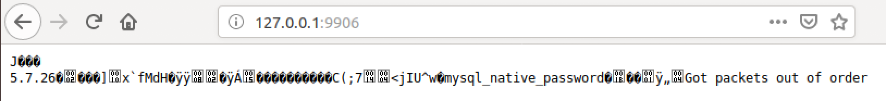
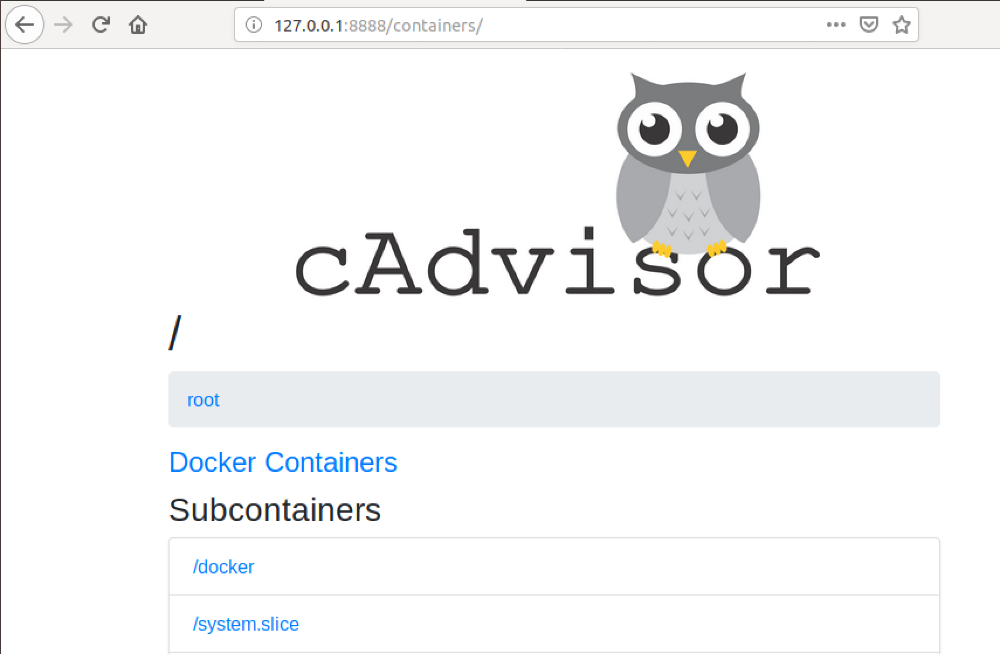

# Technische Berufsschule Zürich Modul 300 Leitsungsbeurteilung 3

1. Persönlicher Wissensstand
   1. Microservice
   2. Containerisierung
   3. Docker
2. Multi Service Container Stack mit Docker-Compose
   1. Vorbereitungen Docker Install
   2. Vorbereitungen Docker Compose Install
   3. Verschiedene Services
      1. PiHole
      2. PHPmyAdmin
      3. mySQL
      4. Apache Server
      5. CadVisor
   4. Der letzte Schritt
   5. Sicherheitsmassnahmen
      1. Überwachung
      2. Sicherheitsmassnahmen
         1. Massnahme 1
         2. Massnahme 2
         3. Massnahme 3
3. Tests
    1. Testfall 1
    2. Testfall 2
    3. Testfall 3
4. Vergleich Vorwissen und Wissenszuwachs
   1. Vorwissen
   2. Wissenszuwachs
5.  Reflexion

# Persönlicher Wissensstand
Persönlicher Wissenstand zu LB3

## Microservicess
Microservices sind ein Weg, Softwaresysteme so zu entwickeln und zu kombinieren, dass sie aus kleinen, unabhängigen Komponenten bestehen, die untereinander über das Netz interagieren. Das steht im Gegensatz zum klassischen, monolithischen Weg der Softwareentwicklung, bei dem es ein einzelnes, grosses Programm gibt.

## Containerisierung
Entwickler können Software lokal bauen, die woanders genauso laufen wird – sei es ein Rack in der IT-Abteilung, der Laptop eines Anwenders oder ein Cluster in der Cloud.

Administratoren können sich auf die Netzwerke, Ressourcen und die Uptime konzentrieren und müssen weniger Zeit mit dem Konfigurieren von Umgebungen und dem Kampf mit Systemabhängigkeiten verbringen.

## Docker
Docker ist ein Programm, das für die Containerisierung genutzt wird. Wenn man das Docker paket herunterlädt bekommt man man einige Features mitinstalliert die man ebenfalls nutzen kann. Docker liefert ein ganzes Set an neuen Kommandos die man sowohl auf der Kommandozeile als auch in Skripts und im Dockerfile nutzen kann. Es hat sehr viele Ähnlichkeiten zu Vagrant. Der grosse unterschied ist nur, dass Vagrant zur Virtualisierung genutzt wird.

# Multi Service Container Stack mit Docker-Compose
## Vorbereitungen Docker Install
Um Später mit dem eigentlichen Aufsetzen des Containers beginnen zu können müssen wir zwei kleine Vorbereitungen treffen. Als erstes die Docker pakete installieren,

First, in order to ensure the downloads are valid, add the GPG key for the official Docker repository to your system:
`curl -fsSL https://download.docker.com/linux/ubuntu/gpg | sudo apt-key add -`

Add the Docker repository to APT sources:
`sudo add-apt-repository "deb [arch=amd64] https://download.docker.com/linux/ubuntu $(lsb_release -cs) stable"`

Next, update the package database with the Docker packages from the newly added repo:
`sudo apt-get update`

Make sure you are about to install from the Docker repo instead of the default Ubuntu 16.04 repo:
`apt-cache policy docker-ce`

Finally, install Docker:
`sudo apt-get install -y docker-ce`

Docker should now be installed, the daemon started, and the process enabled to start on boot. Check that it's running:
`sudo systemctl status docker`

## Vorbereitungen Docker Compose Install
Curl installieren
`sudo apt-get install curl`

Run this command to download the current stable release of Docker Compose:
`sudo curl -L "https://github.com/docker/compose/releases/download/1.24.0/docker-compose-$(uname -s)-$(uname -m)" -o /usr/local/bin/docker-compose`

Apply executable permissions to the binary:
`sudo chmod +x /usr/local/bin/docker-compose`.

Anschliessend müssen wir noch eins, zwei Verzeichnisse erstellen in denen wir unsere Konfigurationen speichern. Ich habe mich für das home-directory des roots entschieden. Es kommt aber nicht wirklich darauf an wo man dies tut.
`mkdir docker`. Nun, da wir einen LAMP Stack aufbauen brauchen wir noch ein Verzeichnis in dem wir die Startseite von unserem Apache speichern. Das habe ich im neuen /docker Verzeichnis gemacht. `mkdir documentroot`. Darin erstellen wir gleich eine index.php Datei mit dem Inhalt `<?php phpinfo(); ?>` um die Standardseite von PHP anzeigen zu lassen wenn wir im Browser auf unseren Container gehen. Danach brauchen wir noch eine .yml Datei in dem wir die docker-compose Konfigurationen speichern. Also direkt im /docker Verzeichnis `touch docker-compose.yml`. Diese Datei können wir nun mit unserem lieblings Editor bearbeiten.

## Konfiguration der docker-compose Datei
In dieser Datei setzen wir nun alle Komnfigurationen fest die wir haben wollen. Am ende sieht diese datei so aus (Achtung! Da diese Datei die YAML Syntax nutzt, muss man auf Zeilenumbrüche und Einschläge besonders acht geben!):

In der ersten Zeile geben wir die Version der docker-compose syntax an. Anschliessend definieren wir alle unsere Services unter `services:`. 

Es beginnt mit dem ersten Abschnitt. Darin ist der Name unseres ersten Services entalten, also `php-apache:`. Danach, woher wir das Image beziehen, also eine Datei im Verzeichnis /php-apache (Dazu später mehr!). Dann welche ports wir freigeben. Hier ist es Port 80 sowie auf dem Host als auch auf dem Container. Anschliessend welches Volume wir mounten möchten. Und zum Schluss des ersten Abschnitts, mit welchem Container wir diesen verlinken wollen.

Im nächsten Abschnitt beschreiben wir unseren Datenbank container. Dabei wird zu erst wieder der Name angegeben. Und als zweites das Image welches wir beziehen. `mariadb:10.1`. Unter `environment:` geben wir der docker-compose.yml Datei mit, welche Konfigurationen während der Installation unseres Datenbank-Containers getroffen werden sollen.

Und zum Schluss müssen noch ein sogenanntes "named volume" erstellen. Dies tun wir mit der Option `volumes:` ganz am Ende der Datei. 

## Verschiedene Services
Hier sind die verschiedenen Services aufgelistet welche nun in Container laufen.

### PiHole
Der Pi Hole Service ist nicht funktionsfähig

##### Container Pihole
Dieser Container beinhaltet die Applikation Pihole, welcher als lokaler DNS Server dient. 

| <tab>             | <tab>                                                       |
| ----------------- | ----------------------------------------------------------- |
| **Configuration** | Value                                                       |
| Container Name    | pihole                                                      |
| Image             | pihole/pihole:latest                                        |
| Ports             | 53:53/tcp , 53:53/udp , 67:67/udp , 80:80/tcp , 443:443/tcp |
| Volumes           | -                                                           |
| DNS               | 127.0.0.1, 1.1.1.1                                          |

### PHPmyAdmin
Der PHPmyAdmin service ist funktionstüchtig

##### Container phpmyadmin
Dieser Container beinhaltet PHP MyAdmin, welche auf den Contaienr db_mysql verlinkt ist. 

| <tab>             | <tab>                  |
| ----------------- | ---------------------- |
| **Configuration** | Value                  |
| container_name    | phpmyadmin             |
| Image             | phpmyadmin/phpmyadmin. |
| Ports             | 8080:80                |
| Volumes           | -                      |

### mySQL
mySQL Service ist auch betriebsbereit

##### Container DB
Dieser Container beinhaltet eine MySQL Datenbank

| <tab>               | <tab>     |
| ------------------- | --------- |
| **Configuration**   | Value     |
| Container Name      | db_mysql  |
| Image               | mysql:5.7 |
| Ports               | 9906:3306 |
| Volumes             | -         |
| MYSQL_ROOT_PASSWORD | 1234      |
| MYSQL_DATABASE      | dbteset   |
| MYSQL_USER          | dbuser    |
| MYSQL_PASSWORD      | 1234      |

### Apache Server
Webserver/Apacheserver ist betriebsbereit

##### Container Web
Dieser Container beinhaltet einen Apache2 Webserver

| <tab>             | <tab>                 |
| ----------------- | --------------------- |
| **Configuration** | Value                 |
| container_name    | php_web               |
| Image             | php:7.2.2-apache      |
| Ports             | 8100:80               |
| Volumes           | ./php/:/var/www/html/ |

### cAdvisor
cAdvisor ist auch aufrufbar

##### Container cadvisor
Dieser Container beinhaltet das Überwachungstool Cadvisor. 

| <tab>             | <tab>                                                                                      |
| ----------------- | ------------------------------------------------------------------------------------------ |
| **Configuration** | Value                                                                                      |
| container_name    | cadvisor                                                                                   |
| Image             | google/cadvisor:v0.29.0                                                                    |
| Ports             | 8888:8080                                                                                  |
| Volumes           | /:/rootfs:ro ,/var/run:/var/run:rw ,  /sys:/sys:ro , /var/lib/docker/:/var , lib/docker:ro |

## Der letzte Schritt
Nun, da wir alle Konfigurationen gemacht haben, können wir die Container starten. `docker-compose up`. Dabei darauf achten, dass wir im gleichen Verzeichnis sind, wie die docker-compose.yml Datei.

Wenn alles korrekt läuft, sehen wir nun folgende Seite, wenn wir im Browser auf unseren Server gehen.

## Sicherheitsmassnahmen
###  Überwachung
Software wie "Rancher" kann genutzt werden im die Container zu überwachen und Meldungen zu erzeugen.

### Sicherheitsaspekte & Sicherheitsmassnahme

#### Massnahme 1: Kernel Exploits
Um Kernel exploits zu verhindern wurden die zugewiesenen System Ressourcen festgelegt.

#### Massnahme 2: Vergiftete Images
Images werden nur von Docker Hub und Dockerverifizierte Sites geladen. Somit ist vereringert das Images Viren und weiteres beinhalten.

#### Massnahme 3: Benachrichtigungen
Mit Überwachungssoftware können überlastungen und anderes unnatürliches verhalten verhindert werden.

## Tests
### Testfall 1
__Titel:__ Start der Container

__Datum:__ 3.5.19

__Beschreibung:__ Die Container werden gestartet.

__Erwartetes Ergebnis:__ Die Erwartung ist, dass verschiedene Container erstellt werden.

__Eigenliches Ergebnis:__ Es sind zwei verschiedene Container erstellt worden. Einer mit dem Namen "docker_mariadb_1" und einer namens "docker_php-apache_1".

### Testfall 2
__Titel:__ PHP Index Seite

__Datum:__ 3.5.19

__Beschreibung:__ Verbindung auf Server via Browser.

__Erwartetes Ergebnis:__ Erfolgreiches Erreichen der Seite des Servers. Es sollte die PHP Index Seite angezeigt werden.

__Eigenliches Ergebnis:__ Erfolgreich auf die Seite gekommen. Bei verändern der index.php Datei hat sich auch direkt die Seit im Browser verändert.

### Testfall 3
__Titel:__ Überwachung

__Datum:__ 3.5.19

__Beschreibung:__ Verbindung auf Server via Browser und Überprüfung der Überwachung.

__Erwartetes Ergebnis:__ Eintrag in der Konsole, dass um diese Zeit ein Benutzer diese Seite aufgerufen hat. Mit dem Browser Google Chrome auf Windows.

__Eigenliches Ergebnis:__ Test war erfolgreich. Folgende Zeile wurde in der Konsole ausgegeben. `php-apache_1  | 212.203.120.1 - - [03/May/2019:11:02:45 +0000] "GET / HTTP/1.1" 200 23807 "-" "Mozilla/5.0 (Windows NT 10.0; Win64; x64) AppleWebKit/537.36 (KHTML, like Gecko) Chrome/73.0.3683.103 Safari/537.36"`.

# Vergleich Vorwissen und Wissenszuwachs
## Vorwissen
Vor dem Modul hatte ich gerade Mal eine grundlegende Anhung was Virtualisierung anbelangt. Ich wusste wie man Virtuelle Maschinen aufbaut, was Cloud Services sind und ein wenig über Containerisierung.

Jedoch hatte ich noch nie von Vagrant oder Docker gehört, deshalb war alles, was die Konfiguartion angeht neu für mich.

## Wissenszuwachs
Ich konnte in diesem Projekt Vagrant sehr gut kennenlernen, und damit arbeiten. Ich hätte jedoch nicht so viel Zeit damit verschwenden sollen, da ich am Ende nicht mehr viel Zeit für die LB3 hatte. 

In der LB3 konnte ich mein Wissen in Docker sehr erweitern, da dies ebenfalls Neuland für mich war.

# Reflexion
Da ich persönlich noch nie mit Vagrant oder Docker gearbeitet habe, war alles neu für mich. Dass die einzelnen Arbeitsschritte grösstenteils bereits Dokumentiert waren, hat mir sehr geholfen.

Womit ich jedoch schwierigkeiten hatte, war der Auftrag selbst. Mir, und warscheinlich auch anderen aus meiner Klasse, war nicht klar was am Ende dieser LBs das Ziel war. 

Weiter stand ich lange an der Konfiguration bzw. Automatisierung der VMs an. Ich verstand anfangs nicht wie, wo und was.

Schlussendlich fand ich dieses Projekt sehr Interessant und ich habe sehr viel neues dazugelernt und ich konnte meine Fähigkeiten in Linux wieder einmal auffrischen.